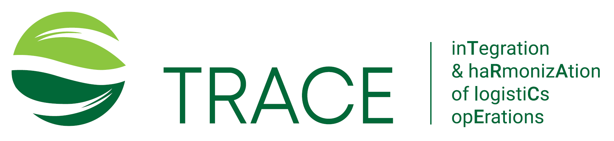

# TRACE Project

## Project Information

Logistics industry is facing continuous and significant challenges during the recent years. The trend is the adoption of intelligent services for increasing the performance of the provided systems and synchromodal operations. Transfers and deliveries can benefit from the use of novel business models that adopt the aforementioned intelligent services when the optimization of the use of shared resources is the core target and become the basis for the provision of a climate friendly infrastructure. The goal of synchromodal operations and the integration of heterogeneous logistics services is the reduction of current transfers in order to reduce the carbon footprint while securing the uninterrupted deliveries and the resilience to any disruptive event. TRACE targets to the aforementioned integration activities offering a universal platform with functionalities related to planning, scheduling, optimization and events management as well as the use of blockchain technology to facilitate the real time conclusion of smart contracts and financial operations, thus, becoming one of the first attempts to provide an ‘intelligent cover’ upon the current logistics frameworks. TRACE envisions real demonstrators in different European countries with different goals that start from transportations with the use of shared resources, the disruptive events detection and re-scheduling of transfers while concluding with the use of unmanned vehicles to automate the last mile deliveries. TRACE also proposes new transfer corridors, safe areas where unmanned vehicles can collect items towards the final destination and new (virtual) hubs. TRACE will perform studies related to the barriers towards the new logistics era, the new business opportunities, the requirements for the legislation and regulatory frameworks and expose the benefits of the proposed approach in terms of the reduction for energy demand and emissions while limiting the operational costs for logistics stakeholders.

## Website and Social Media

* [TRACE Website](https://trace-horizon.eu/)
* [Twitter/X](https://twitter.com/TRACE_HORIZON)
* [LinkedIn](https://www.linkedin.com/company/trace-horizon-project/https://www.linkedin.com/company/trace-horizon-project/)
* [Stack Overflow](https://stackoverflow.com/users/22865582/trace)
